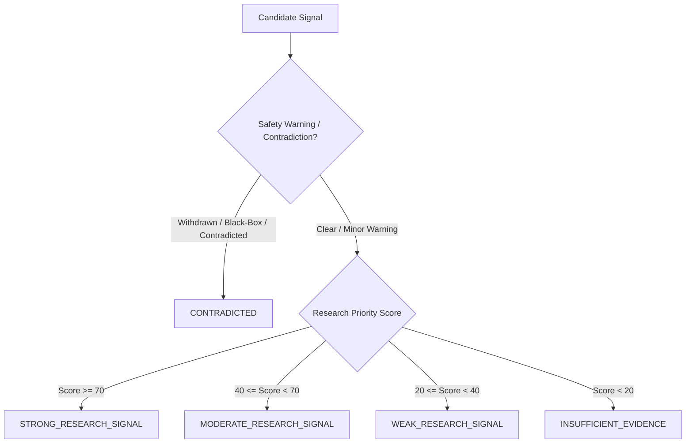

# Signal Intelligence Engine V2 — Specification & Architecture

## 1. Executive Overview

The **PRISM-Rx Signal Intelligence Engine V2** (`src/signals/engine_v2.py`) transforms raw multi-hop Knowledge Graph paths into ranked, explainable, evidence-aware **Computational Research Signals**. 

While graph traversals generate over **2.97 million candidate paths**, vast numbers represent duplicate target linkages or low-confidence associations. Signal Intelligence Engine V2 collapses paths into unique **(Drug, Disease)** candidate pairs, applies a transparent multi-factor evidence scoring model, enforces safety/contradiction penalties, and categorizes signals for research prioritization.

> [!IMPORTANT]
> **Scientific Disclaimer**: All outputs are **Computational Research Hypotheses / Research Priorities**. The engine does NOT generate medical recommendations or predict clinical treatment success.

---

## 2. Comparison: Signal Engine V1 vs. Signal Intelligence Engine V2

| Parameter | Signal Engine V1 (`engine.py`) | Signal Intelligence Engine V2 (`engine_v2.py`) |
| :--- | :--- | :--- |
| **Candidate Unit** | Individual 3-node paths (multi-path duplication) | **Collapsed Unique `(Drug, Disease)` Pairs** |
| **Multi-Target Support** | Ignored (treated as separate output rows) | **Capped Multi-Target Bonus** |
| **Evidence Weighting** | Uniform scoring (all rows equal) | **Quality Tiering (High / Medium / Low)** |
| **Source Diversity** | Single source = Multiple sources | **Multi-Source Diversity Factor** |
| **Safety Penalties** | None (ignored `drug_warnings`) | **Safety & Contradiction Penalty Deductions** |
| **Clinical Trial Evidence**| Hardcoded default fallback | **Extracted from `clinical_reports`** |
| **Scoring Formula** | Simple 4-term static weight sum | **100-Point Multi-Factor Evidence Score** |
| **Categorization** | Basic 4-tier score binning | **5 Evidence Tiers + Safety Contradiction Status** |
| **Explainability** | Hardcoded template strings | **Dynamic Evidence Synthesis & Limitations** |

---

## 3. Multi-Factor Evidence Scoring Model (0 – 100 Scale)

The **Research Priority Score** is calculated as a composite sum of 7 positive evidence dimensions minus 2 penalty dimensions, normalized to a `0 – 100` scale.

$$\text{Research Priority Score} = \text{Clamp}_{0}^{100}\left( S_{TD} + S_{DT} + S_{Clin} + S_{Lit} + F_{Div} + B_{Target} + S_{Nov} - P_{Safety} - P_{Contra} \right)$$

### Scoring Dimensions Breakdown

```
+-----------------------------------------------------------------------------+
|                            RESEARCH PRIORITY SCORE                          |
+-----------------------------------------------------------------------------+
|  [+] Target-Disease Association Score (max 30 pts)                          |
|  [+] Drug-Target Action Confidence (max 15 pts)                             |
|  [+] Clinical Precedence & Trial Phase (max 15 pts)                          |
|  [+] Literature & Evidence Quality (max 10 pts)                             |
|  [+] Source Diversity Factor (max 10 pts)                                   |
|  [+] Multi-Target Support Bonus (max 10 pts)                                |
|  [+] Under-Investigated Novelty Score (max 10 pts)                          |
|  ------------------------------------------------                         |
|  [-] Safety & Black-Box Warning Penalty (-10 to -40 pts)                    |
|  [-] Contradiction / Opposing Trait Penalty (-15 to -30 pts)                 |
+-----------------------------------------------------------------------------+
```

| Dimension | Max Points | Calculation & Weighting Logic |
| :--- | :---: | :--- |
| **A. Target-Disease ($S_{TD}$)** | **30** | $\max(td\_score) \times 30.0$. Reflects highest experimental target-disease association score in database. |
| **B. Drug-Target ($S_{DT}$)** | **15** | Action confidence: Inhibitor/Antagonist (0.9), Blocker/Agonist (0.8), Modulator (0.7), Regulator (0.6). $15.0 \times \text{confidence}$. |
| **C. Clinical Evidence ($S_{Clin}$)** | **15** | Max phase from `clinical_reports`: Phase 4 (1.0), Phase 3 (0.8), Phase 2 (0.6), Phase 1 (0.4), Preclinical (0.1). $15.0 \times \text{stage\_score}$. |
| **D. Literature Tier ($S_{Lit}$)** | **10** | High Quality (1.0), Medium (0.7), Low (0.4). Based on evidence type and peer-reviewed literature links. |
| **E. Source Diversity ($F_{Div}$)** | **10** | $\min(1.0, N_{sources} / 4.0) \times 10.0$. Rewards independent verification across Open Targets, Europe PMC, ClinicalTrials.gov, UniProt. |
| **F. Multi-Target Bonus ($B_{Target}$)** | **10** | Capped log bonus for multi-target hits: $\min(10.0, 5.0 \times \log_2(N_{targets}))$. |
| **G. Novelty Score ($S_{Nov}$)** | **10** | $10.0$ for non-indicated drug pairs, scaled down if high trial saturation exists for same condition. |
| **H. Safety Penalty ($P_{Safety}$)** | **-40** | Withdrawn status (-40 pts), Black-box warning (-25 pts), General warning present (-10 pts). |
| **I. Contradiction Penalty ($P_{Contra}$)** | **-30** | Opposing direction on trait or conflicting mechanism of action (-15 to -30 pts). |

---

## 4. Evidence Quality Tiers & Classification

| Quality Tier | Criteria | Base Score Contribution |
| :--- | :--- | :---: |
| **HIGH** | Clinical trial evidence present AND target-disease score $> 0.5$ across $\ge 2$ independent sources. | 1.0 (10 pts) |
| **MEDIUM** | Valid mechanism of action (e.g. INHIBITOR) AND target-disease score $> 0.2$. | 0.7 (7 pts) |
| **LOW** | Single-source association with indirect mechanism or score $< 0.2$. | 0.4 (4 pts) |
| **UNKNOWN** | Insufficient evidence rows or missing mechanism metadata. | 0.0 (0 pts) |

---

## 5. Signal Categories & Decision Thresholds

Candidates are assigned to one of 5 mutually exclusive research categories based on final score and safety/contradiction penalties:



1. **`STRONG_RESEARCH_SIGNAL`**: Score $\ge 70.0$, 0 safety penalties. High research priority for experimental validation.
2. **`MODERATE_RESEARCH_SIGNAL`**: $40.0 \le \text{Score} < 70.0$, minor warnings allowed ($\le 10$ pts penalty).
3. **`WEAK_RESEARCH_SIGNAL`**: $20.0 \le \text{Score} < 40.0$, limited evidence or single-source dependency.
4. **`CONTRADICTED`**: Safety Penalty $\ge 25.0$ OR Contradiction Penalty $> 0$. Flagged for safety concerns.
5. **`INSUFFICIENT_EVIDENCE`**: Score $< 20.0$, low confidence links.

---

## 6. Duplicate Path Collapsing & Multi-Target Aggregation

### Problem
A single drug (e.g. Tg100-801) targeting multiple proteins (FGR, LYN, YES1) that all associate with Acute Lymphoblastic Leukemia would produce **3 separate signal outputs** in V1.

### Solution (V2 Path Collapsing)
All 3 graph paths are collapsed into **1 candidate payload** for `(Tg100-801, acute lymphoblastic leukemia)`:
* Supporting paths are stored in `supporting_paths` list.
* Multi-target bonus $B_{Target} = 5.0 \times \log_2(3) = 7.92$ pts added.
* Single explainable report generated summarizing all biological targets.
